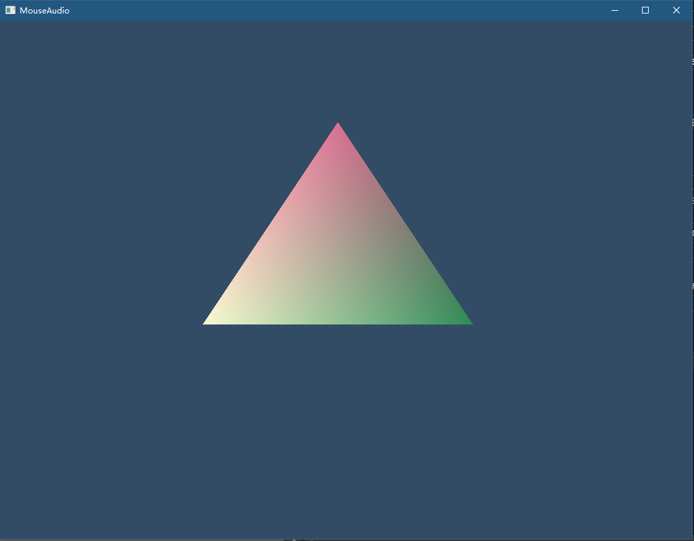
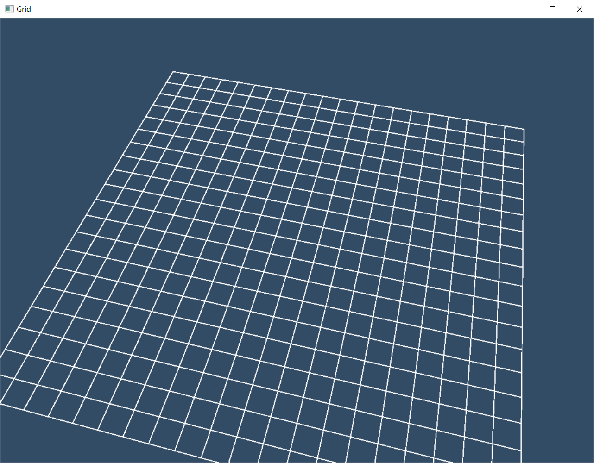

# Hello Dx
## Build status

|[Windows][win-link] |
| :---------------: |
| ![win-badge]      |

[win-badge]: https://ci.appveyor.com/api/projects/status/gup0dy0cc2d25m7o?svg=true "AppVeyor build status"
[win-link]: https://ci.appveyor.com/project/jiawentao/hellodirectx "AppVeyor build status"

## License

## 简介

用来学习DirectX11/12图形编程的一些项目。

参考

* http://www.rastertek.com/tutdx11.html

* https://github.com/Microsoft/DirectXTK/wiki

tutdx11网站中有些功能太旧了，只参考其中的思路，功能尽量用新的。

特别是ComPtr和std智能指针管理内存, D3DXMath 用 DirectXTK 中的SimpleMath。

## 目录结构

- Tao3DCore

  公用的部分，可复用的窗口渲染框架。

  没有用微软那一套UWP框架, 自己重写的窗口渲染框架

  由每个Examples直接添加源码到项目中使用

- Triangle

  渲染三角形
    
  新框架，使用DirectXTK现有的功能，代码行数急剧下降。
  
  

- DrawText

	字体渲染

  字体用DirectX提供的工具MakeSpriteFont.exe生成，引用的是系统字体，比前面那个自己做的强了很多。

  可以通过这个脚本DrawText\Assets\GenFont.ps1生成字体文件

  鼠标位置写出来，这个想法来自tutdx11 13章

	

- MouseKeyboard

  场景贴图，使用键盘可以上下左右移动、鼠标控制相机视口。
  
  参考 https://github.com/Microsoft/DirectXTK/wiki/Mouse-and-keyboard-input

   

- Texture
    
    精灵渲染 一只猫
    
    

- Grid
	
	画一个网格

	

## 安装依赖

  使用vcpkg
  vcpkg install directxtk:x64-windows directxtex:x64-windows

### 联系方式:

***

| 作者 | 涛哥                           |
| ---- | -------------------------------- |
| QQ、TIM   | 759378563                      |
| 微信 | xsd2410421                       |
| 邮箱 | jared2020@163.com                |
| blog | https://wentaojia2014.github.io/ |

***

QQ(TIM)、微信二维码

###### 请放心联系我，乐于提供咨询服务，也可洽谈有偿技术支持相关事宜。

***
#### **打赏**

###### 觉得分享的内容还不错, 就请作者喝杯奶茶吧~~
***
