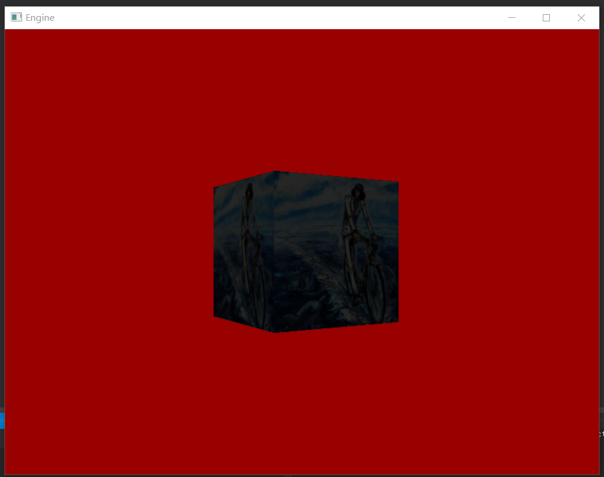
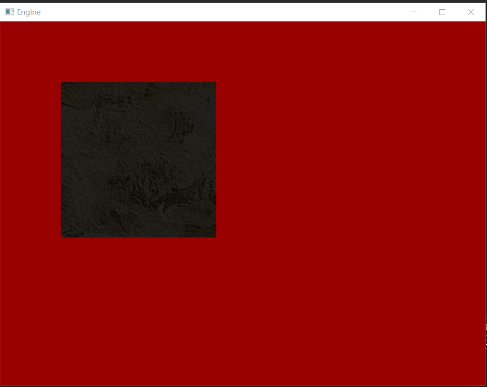
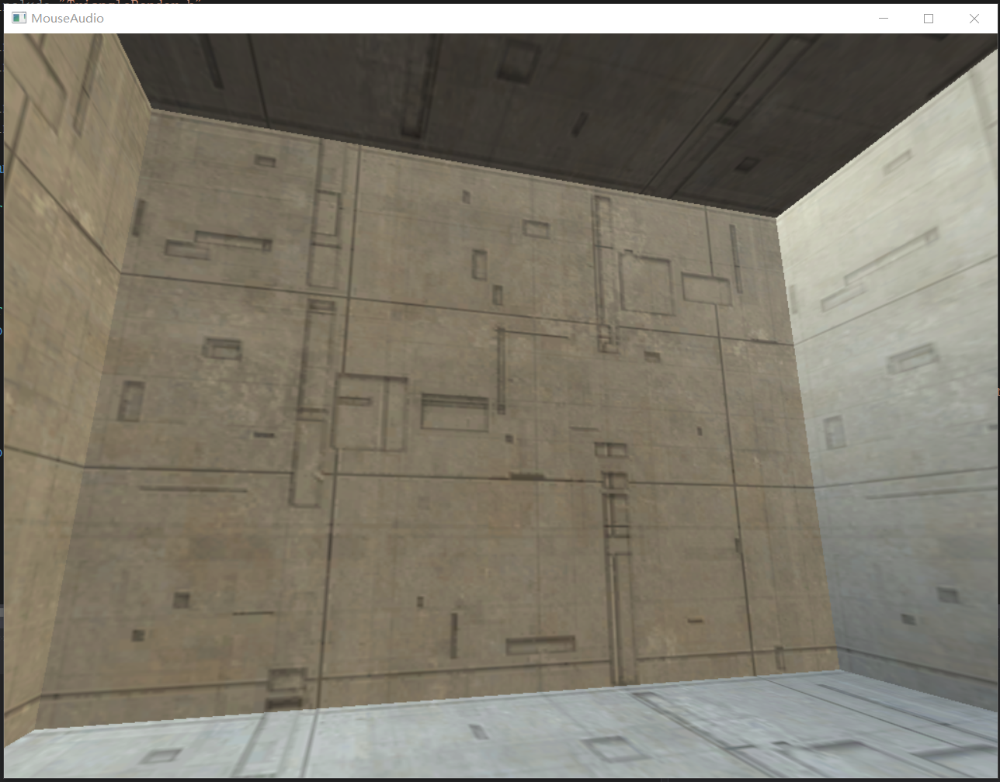
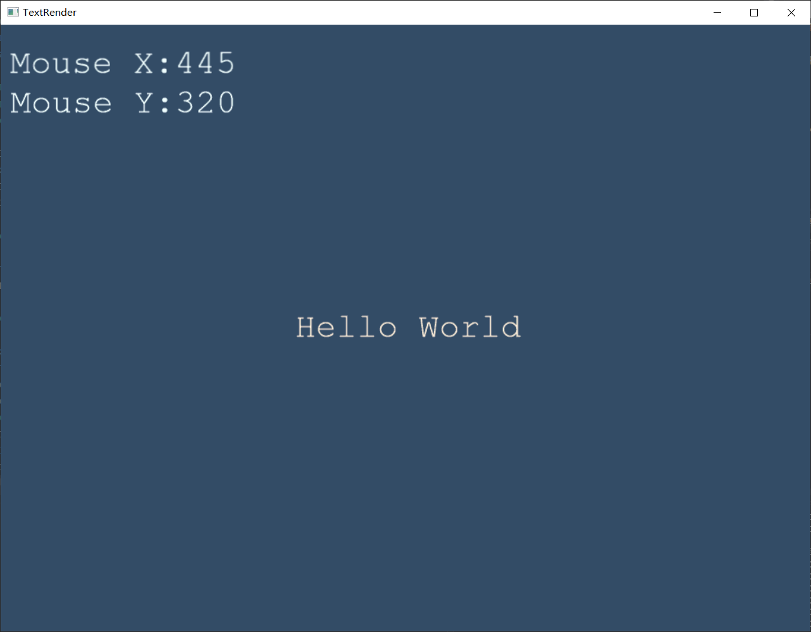
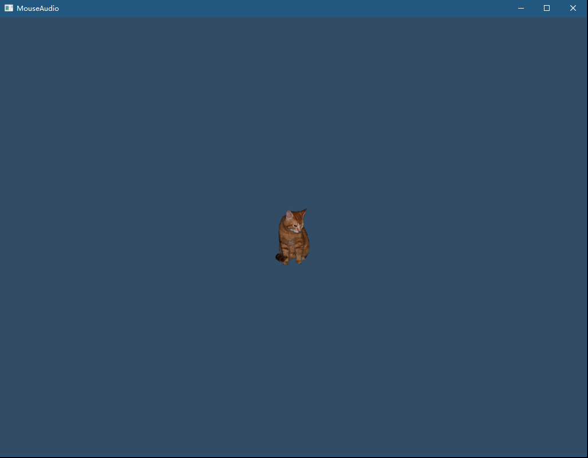

# Hello Dx
## Build status

|[Windows][win-link] |
| :---------------: |
| ![win-badge]      |

[win-badge]: https://ci.appveyor.com/api/projects/status/gup0dy0cc2d25m7o?svg=true "AppVeyor build status"
[win-link]: https://ci.appveyor.com/project/jiawentao/hellodirectx "AppVeyor build status"

## License

## 简介

用来学习DirectX11/12图形编程的一些项目。

参考

* http://www.rastertek.com/tutdx11.html

* https://github.com/Microsoft/DirectXTK/wiki

tutdx11网站中有些功能太旧了，俺都顺手给换新的。

特别是ComPtr和std智能指针管理内存, D3DXMath 用 DirectXTK 中的SimpleMath。

当然还有一些写的比较差的代码，诸如频繁内存分配的，都给优化掉。

## 目录结构
- Tao3DCommon
	
	(旧的)

  公用的部分，单独的库，以dll的方式导出给Examples使用 

- Tao3DCore
	
	(新的)

  公用的部分，可复用的窗口渲染框架，由每个Examples直接添加源码到项目中使用

- HelloDx

  DirectX的基本功能使用
  
  (tutdx11教程的前10章都在这里面了)

  

- 2DRender

  3D场景中渲染2D纹理

  (tutdx11教程的11章)

  

- FontEngine
  
  字体渲染

  (tutdx11教程的12章)

  

- ObjConvert

  命令行工具，用来转换obj格式模型文件为txt格式
  
  (tutdx11教程的7、8章用到转换器)

- MouseKeyboard

  场景贴图，使用键盘可以上下左右移动、鼠标控制相机视口。
  
  参考 https://github.com/Microsoft/DirectXTK/wiki/Mouse-and-keyboard-input

  功能一样，但是没有用微软那一套UWP框架

  自己重写的窗口渲染框架，与前面的Examples都不一样了。

  

- DrawText

	字体渲染

  字体用DirectX提供的工具MakeSpriteFont.exe生成，引用的是系统字体，比前面那个自己做的强了很多。

  可以通过这个脚本DrawText\Assets\GenFont.ps1生成字体文件

  鼠标位置写出来，这个想法来自tutdx11 13章

	
- Texture
    
    精灵渲染 一只猫
    
    

## 安装依赖

  使用vcpkg
  vcpkg install directxtk:x64-windows directxtex:x64-windows

#### 联系方式:
***
|作者|涛哥|
|---|---|
|QQ|759378563|
|微信|xsd2410421|
|邮箱|jared2020@163.com|
|blog|https://wentaojia2014.github.io/|

###### 请放心联系我，乐于提供相关帮助
***
#### **打赏**

###### 觉得分享的内容还不错, 就请作者喝杯奶茶吧~~
***